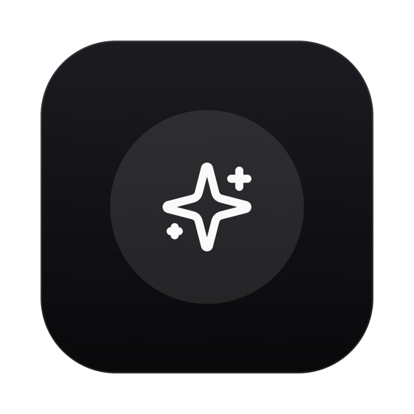
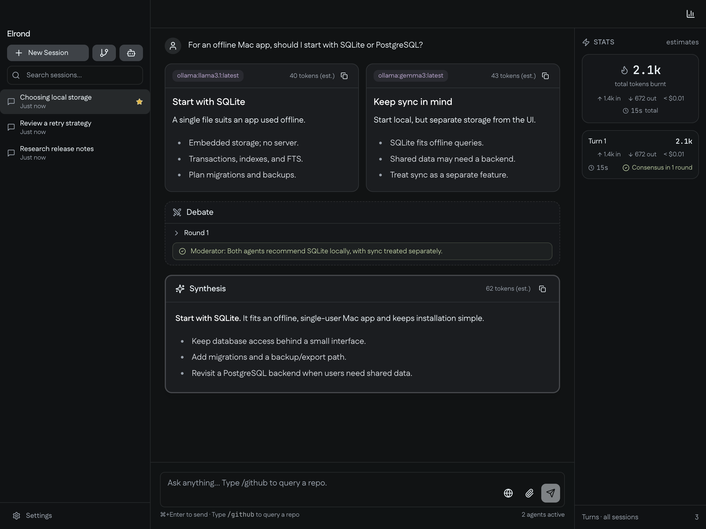

<p align="center">
  
</p>

<h1 align="center">Elrond</h1>

<p align="center"><strong>A council of AI models for your Mac.</strong></p>

Ask one question, compare answers from OpenAI, Anthropic, Google, or local Ollama models, and get a final synthesis after an optional debate.



*A deliberation with two Ollama models. Screenshots show sample data in the actual app UI.*

## Setup and install

Requirements: **macOS 13+**, **Node.js 22.12+** (or **20.19+** on the 20.x line), and API keys for cloud models or a running [Ollama](https://ollama.com) server with models already pulled.

```bash
git clone https://github.com/Captain-Sangam/Elrond.git elrond
cd elrond
make install
make dev
```

To build and install the standalone app, quit any running Elrond instance and run:

```bash
make export
```

This installs `Elrond.app` into `/Applications`, falling back to `~/Applications`. Launch it from Spotlight. See [packaging and installation](docs/deployment.md) for details.

On first launch, follow the setup wizard to add provider credentials and choose models. A detected local Ollama server lets you start without cloud keys. In **Agents** (the sidebar bot icon), enable at least two agents for debate and choose the synthesizer.


## Documentation

See [docs](docs/README.md) for the user guide, features, architecture, development, packaging, and implementation plans.

Contributions are welcome: read [CONTRIBUTING.md](CONTRIBUTING.md). Elrond is available under the [MIT License](LICENSE).
