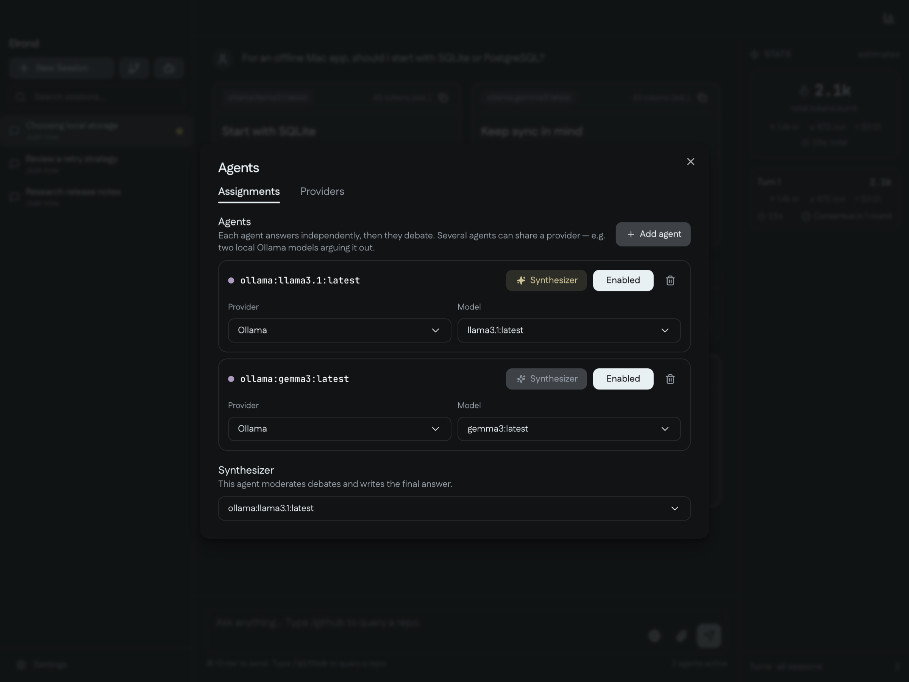

# User guide

Ask one question, compare independent answers, and let the models challenge and revise each other's reasoning before a final synthesis. Elrond brings that workflow into a desktop app for code questions, research, writing, and decisions that benefit from several perspectives.

Mix OpenAI, Anthropic, Google, and local Ollama models in the same council. Conversations and attachments are stored on your Mac, credentials live in the macOS Keychain, and local deliberation can run entirely through Ollama.

See the [README](../README.md#setup-and-install) for installation and requirements.

## Highlights

- Independent answers streamed in parallel from any mix of supported providers
- Focused debate rounds built around stable unresolved issues
- A moderator that distinguishes agreement, unchanged positions, round limits, and incomplete reviews
- A final synthesis from the agent you choose, with debate optional
- Image and PDF attachments for compatible models
- Optional web search, GitHub code context, and live MCP tool calls
- Collapsible debates, consistent Markdown formatting, and copyable code blocks
- Searchable, starred conversations with Markdown and JSON export
- Per-turn token, cost, and timing breakdowns, with usage figures labeled as estimates
- A configurable global shortcut to bring the running app to the front

## How deliberation works

1. **Independent answers.** Your prompt and selected context go to every enabled agent in parallel.
2. **Focused debate.** Agents critique the other answers, revise their positions, and address the moderator's unresolved issues in subsequent rounds. An agent can leave its answer unchanged when it has nothing to revise.
3. **An explicit outcome.** The moderator checks agreement. The debate can also end when positions stop changing, the round limit is reached, or a review cannot complete; those outcomes remain visible rather than being reported as consensus.
4. **Final synthesis.** Your designated synthesizer brings the final positions and moderator findings into one response.

Choose one to five debate rounds, or turn debate off to go straight from independent answers to synthesis. With only one enabled agent, Elrond reuses its answer directly. Model assignments, context toggles, and connected tools remain under your control.

## First launch

The setup wizard walks you through provider credentials, model selection, and the global shortcut. If a local Ollama server with pulled models is detected, you can skip cloud keys and start with local agents.

| Provider | Setup |
| --- | --- |
| OpenAI | Add an [API key](https://platform.openai.com/api-keys) |
| Anthropic | Add an [API key](https://console.anthropic.com/settings/keys) |
| Google | Add an [API key](https://aistudio.google.com/apikey) |
| Ollama | Start your local server and pull the models you want to use; no API key is required |

Manage the council in **Agents** (the bot icon in the sidebar): add or remove agents, assign provider/model pairs, enable participants, and choose the synthesizer. Several agents can use different models from the same provider, including an entirely local Ollama council.

The default global shortcut is **Control+Shift+Space**. It focuses Elrond while the app is running. Closing the window quits the app.

## Optional context and tools

| Integration | Configure | What it adds |
| --- | --- | --- |
| GitHub | Settings → GitHub, with a [personal access token](https://github.com/settings/tokens/new?scopes=repo&description=Elrond) | `/github` repository selection, local code indexing, and live PR, commit, and issue context |
| Web search | Settings → Web Search, with a [Tavily key](https://app.tavily.com) | The globe toggle retrieves current results for a prompt and supplies sources to the agents |
| MCP | Settings → MCP | Tools agents can call during initial answers and debate rounds |

MCP presets cover **Linear, Notion, GitHub, Sentry, Context7, and Filesystem**. You can also connect a custom stdio or HTTP server. Tool calls show their progress and result previews in the response panels; the input's plug toggle controls whether connected tools are available for a turn.

Attach images or PDFs with the paperclip, drag-and-drop, or image paste. Support depends on the selected model; Ollama receives images, while PDFs are unsupported by the Ollama adapter. See [Features](features.md) for attachment limits and integration details.

## Privacy and storage

Session history, attachments, and indexed repositories stay on your machine. API keys and integration secrets are stored in the macOS Keychain. Elrond has no telemetry, cloud sync, or separate Elrond account.

Cloud models receive the prompts and context supplied to them, and remote integrations contact their configured services. For local-only deliberation, use local Ollama models and keep cloud integrations off.
